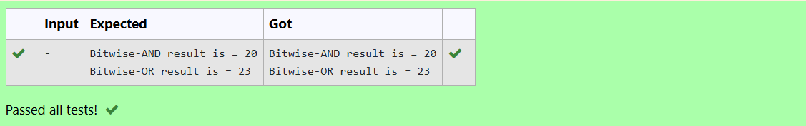
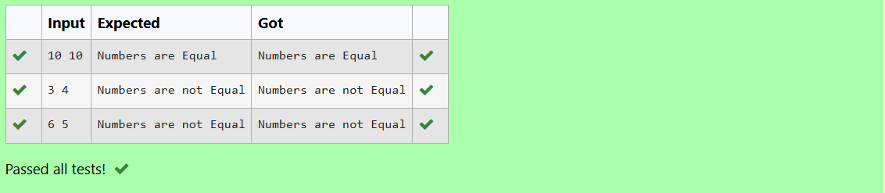
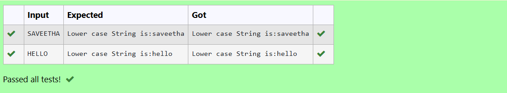
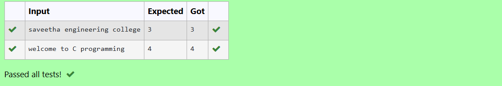
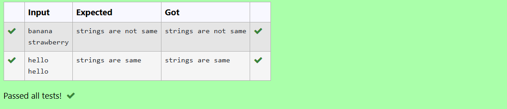

# EX-16-BITWISE-OR-and-AND-OPERATION
## AIM
To write a C Program to perform bitwise AND operation and bitwise OR operation of 21 and 22 integers. 

## ALGORITHM

1. Start
2. Declare integer variables a, b, andResult, and orResult.
3. Assign a = 21 and b = 22.
4. Perform bitwise AND operation using andResult = a & b.
5. Perform bitwise OR operation using orResult = a | b.
6. Display the result of the bitwise AND operation.
7. Display the result of the bitwise OR operation.
8. Stop

## PROGRAM
~~~
#include <stdio.h>

int main() {
    int a = 21, b = 22;  // given integers
    int andResult, orResult;

    andResult = a & b;   // Bitwise AND
    orResult = a | b;    // Bitwise OR

    printf("Bitwise-AND result is = %d\n", andResult);
    printf("Bitwise-OR result is = %d\n", orResult);

    return 0;
}
~~~
## OUTPUT

## RESULT
Thus the C Program to perform bitwise AND operation and bitwise OR operation of 21 and 22 integers has been executed successfully.

 
 

# EX-17-TWO-NUMBERS-ARE-EQUAL-OR-NOT

## AIM

Write a C Program to check whether the two numbers are equal or not using simple if statement.

## ALGORITHM

1.	Start the program.
2.	Read two numbers.
3.	If first number is equal to second number, display both are equal.
4.	Otherwise display both are not equal.
5.	Stop the program.

## PROGRAM
~~~
#include <stdio.h>

int main() {
    int a, b;

    scanf("%d %d", &a, &b);

    if (a == b)
        printf("Numbers are Equal\n");

    if (a != b)
        printf("Numbers are not Equal\n");

    return 0;
}
~~~
## OUTPUT

           
## RESULT
Thus the program to check whether the two numbers are equal or not using simple if statement has been executed successfully.
 
 

# EX-18-STRING-LOWERCASE-CONVERSION
## AIM
Write a C Program to convert the given string into lowercase.

## ALGORITHM
1.	Start the program.
2.	Read a string variable.
3.	Using tolower( ) function convert the given string into its lowercase.
4.	Display the result.
5.	Stop the program.

## PROGRAM
~~~
#include <stdio.h>
#include <string.h>
#include <ctype.h>
int main()
{
    char str[100];
    int i;
    scanf("%s", str);
    for(i = 0; str[i] != '\0'; i++)
    {
        str[i] = tolower(str[i]);
    }
    printf("Lower case String is:%s\n", str);
    return 0;
}
~~~
## OUTPUT

## RESULT
Thus the program to convert the given string into lowercase has been executed successfully.
 
 

# EX-19-COUNT-OF-WORDS-IN-A-STRING
## AIM
Write a C Program to count the total number of words in a given string using for loop.

## ALGORITHM
1.	Start the program.
2.	Read a string variable.
3.	Using for loop, inspect the string character by character.
4.	Whenever a space is encountered increment count by 1.
5.	Display the result.
6.	Stop the program.

## PROGRAM
~~~
#include <stdio.h>
#include <string.h>
#include <ctype.h>
int countWords(char str[]) {
    int count = 0, i;
    for (i = 0; str[i] != '\0'; i++) {
        // When we find the start of a word
        if ((i == 0 && str[i] != ' ') || 
            (str[i] != ' ' && str[i - 1] == ' '))
            count++;
    }
    return count;
}
int main() {
    char str[200];
    int total;
    fgets(str, sizeof(str), stdin);
    str[strcspn(str, "\n")] = '\0';
    total = countWords(str);
    printf("%d\n", total);
    return 0;
}
~~~
## OUTPUT

## RESULT
Thus the program to count the total number of words in a given string using for loop has been executed successfully.
 
 

# EX  -20 -COMPARING TWO STRINGS
## AIM
write a Program to compare two strings using strcmp().

## ALGORITHM
1. Start
2. Declare two character arrays str1[100] and str2[100].
3. Declare an integer variable result.
4. Read the first string and store it in str1.
5. Read the second string and store it in str2.
6. Compare both strings using the function strcmp(str1, str2) and store the result in result.
7. If result == 0, print "strings are same".
8. Otherwise, print "strings are not same".
9. Stop

## PROGRAM
~~~
#include <stdio.h>
#include <string.h>
int main()
{
    char str1[100], str2[100];
    int result;
    scanf("%s", str1);
    scanf("%s", str2);
    result = strcmp(str1, str2);
    if (result == 0)
        printf("strings are same\n");
    else
        printf("strings are not same\n");
    return 0;
}
~~~
## OUTPUT
 

## RESULT
Thus the C Program to compare two strings using strcmp() has been executed successfully.

